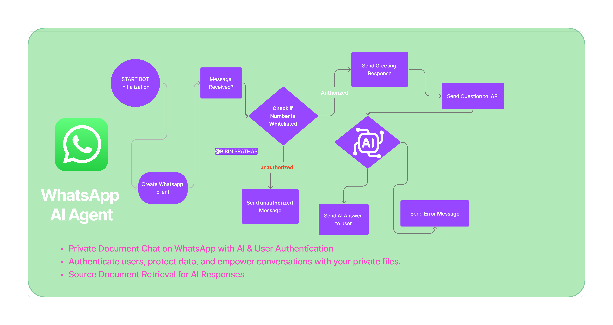

<h1>AI Agent for WhatsApp 🤖</h1> 

 

 

# AI Agent for WhatsApp 🤖💬

An AI-powered WhatsApp agent that leverages advanced natural language processing to provide intelligent responses and automate conversations.

## Features ✨

- **Private Document Chat on WhatsApp with AI & User Authentication**:  Securely chat with AI while keeping documents private.

- **Authenticate users, protect data, and empower conversations with your private files**:  Ensure only authorized users access sensitive information.

- **Source Document Retrieval for AI Responses**:  Trace AI-generated answers back to the original document for transparency and verification.
- **Natural Language Understanding**: Processes user messages with AI comprehension
- **Automated Responses**: Provides instant replies to common queries
- **Context Awareness**: Maintains conversation context for more natural interactions
- **Multi-language Support**: Communicates in various languages
- **Easy Integration**: Simple setup with WhatsApp Business API

## Installation 🛠️

### Prerequisites
- Node.js (v14 or later)

### Setup Steps

1. Clone the repository:
```bash
git clone https://github.com/bibinprathap/AI-Agent-whatsapp.git
cd AI-Agent-whatsapp
```

2. Install dependencies:
```bash
npm install
```

3. Configure environment variables:
```bash
cp .env.example .env
# Edit .env with your credentials
```

4. Start the server:
```bash
npm start
```
 

## Usage 📲

1. Connect your WhatsApp number in the Business Manager
2. The AI agent will automatically handle incoming messages
3. Monitor conversations in the dashboard

## Contributing 🤝

We welcome contributions! Please follow these steps:

1. Fork the repository
2. Create your feature branch (`git checkout -b feature/AmazingFeature`)
3. Commit your changes (`git commit -m 'Add some AmazingFeature'`)
4. Push to the branch (`git push origin feature/AmazingFeature`)
5. Open a Pull Request

## License 📄

This project is licensed under the MIT License - see the [LICENSE](LICENSE) file for details.

## Support 💡

For support or feature requests, please [open an issue](https://github.com/bibinprathap/AI-Agent-whatsapp/issues).

---

**Let's build the future of conversational AI together!** 🚀
 

You can copy this directly into your README.md file. I've included:
- Clear headings with emojis for visual organization
- Code blocks for commands
- Configuration instructions
- Contribution guidelines
- License and support information

Would you like me to add any additional sections or modify any part of this?
